<p align="center">
  <h1 align="center">🌠 DaysMatter</h1>
  <p align="center"><em>流星划过许愿单 — 你的私人倒数日、愿望矩阵与备忘录系统</em></p>
</p>

<p align="center">
  
  
  
  
</p>

# 中文介绍

---

## 😁初衷

由于手机app上很多管理软件功能不能自定义化，还有开屏广告、弹窗广告、摇一摇广告！于是就有本项目的诞生。

Memory: 25.37MB

## ✨界面预览

### 登录界面

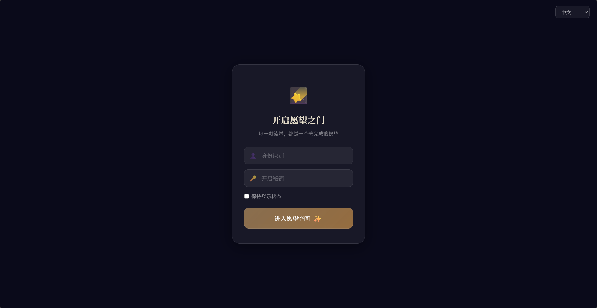

### 倒数日

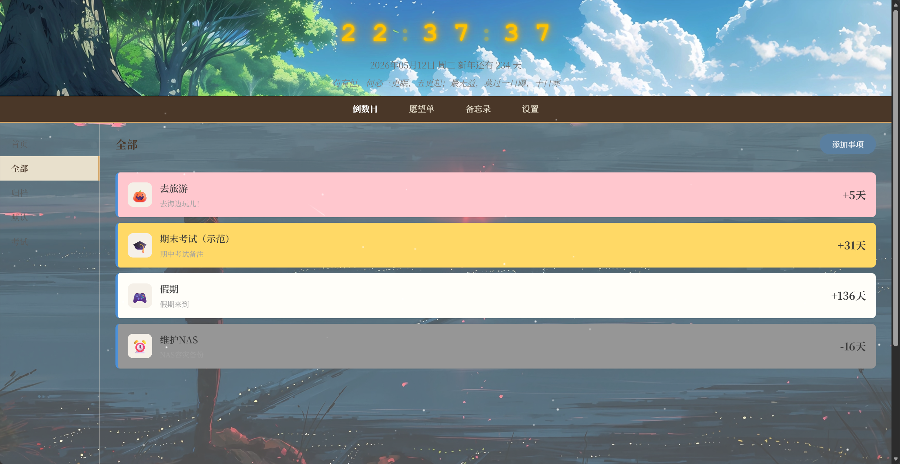

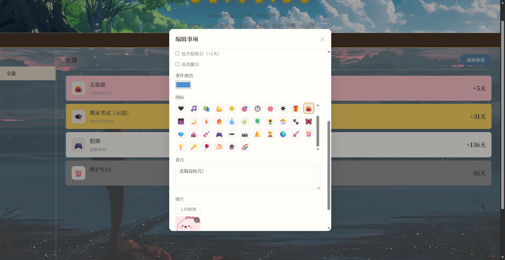

### 愿望单

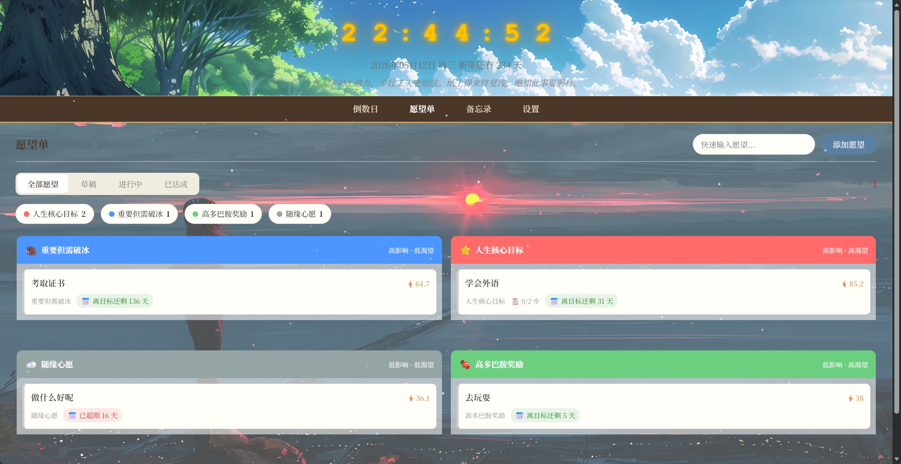

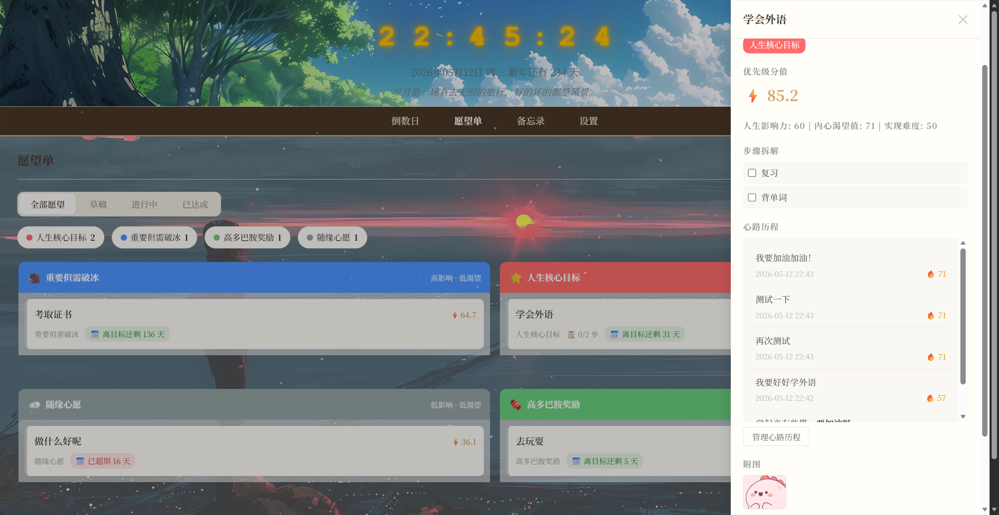

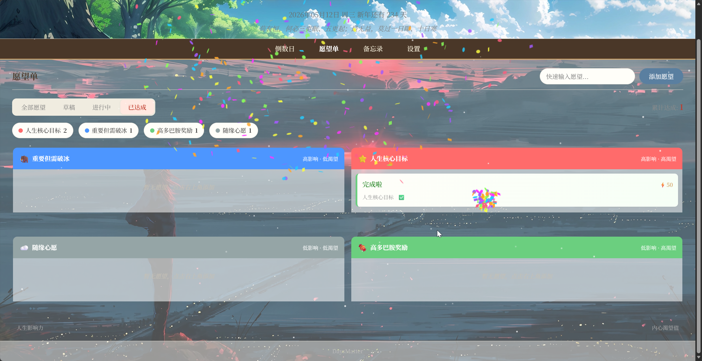

### 备忘录

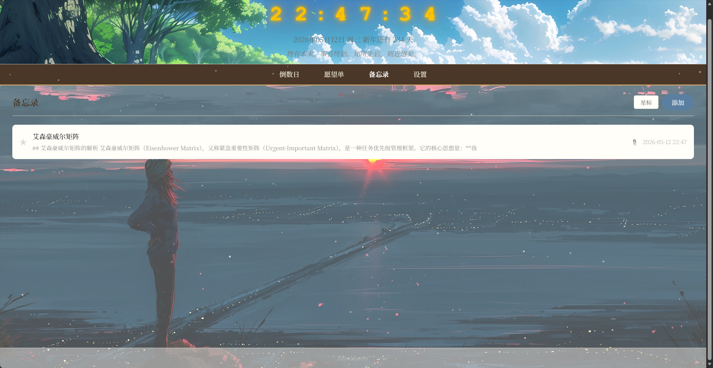

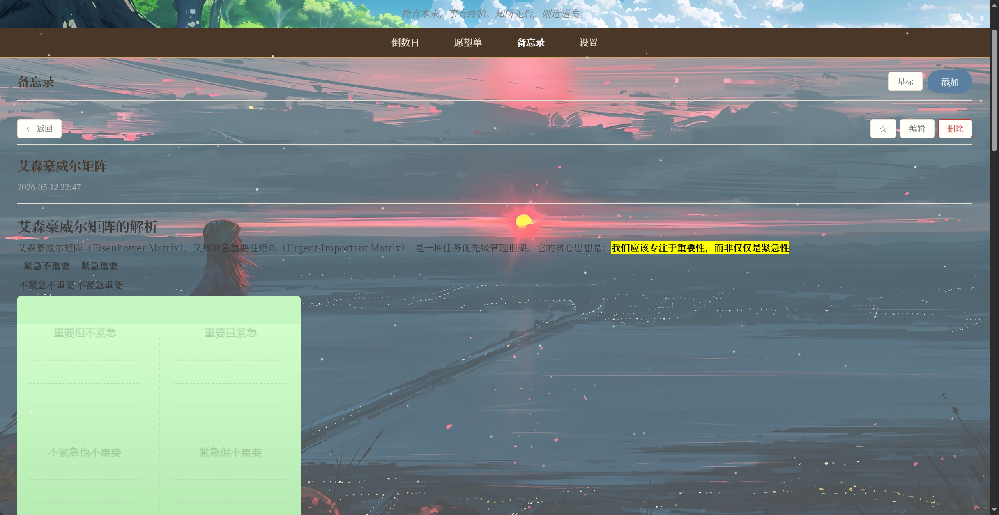

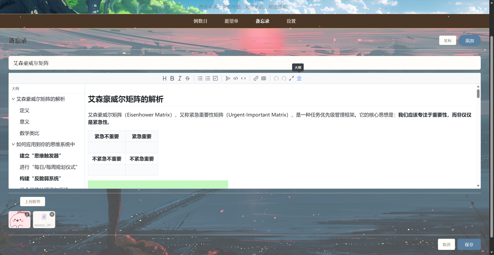

### 设置

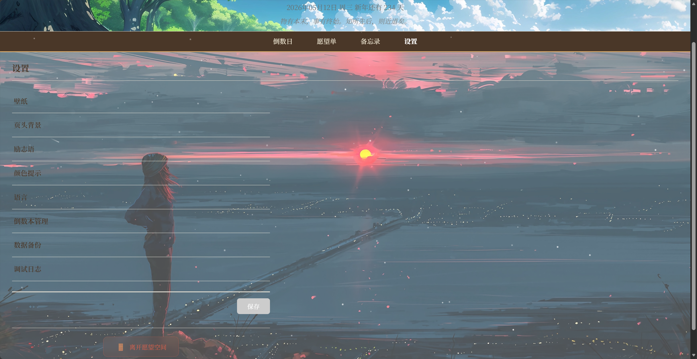

### 英文界面

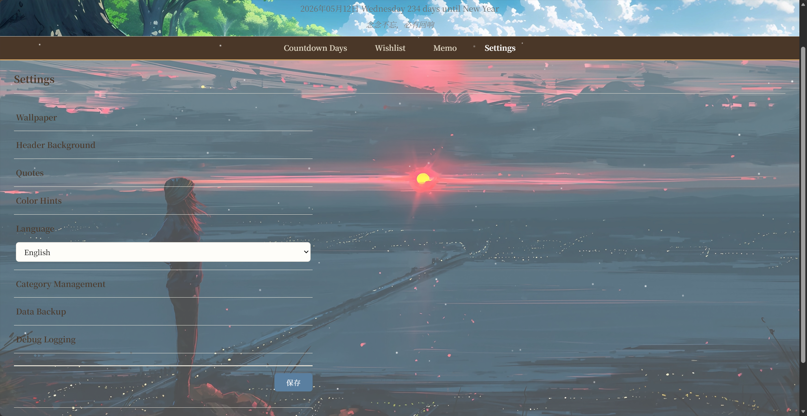

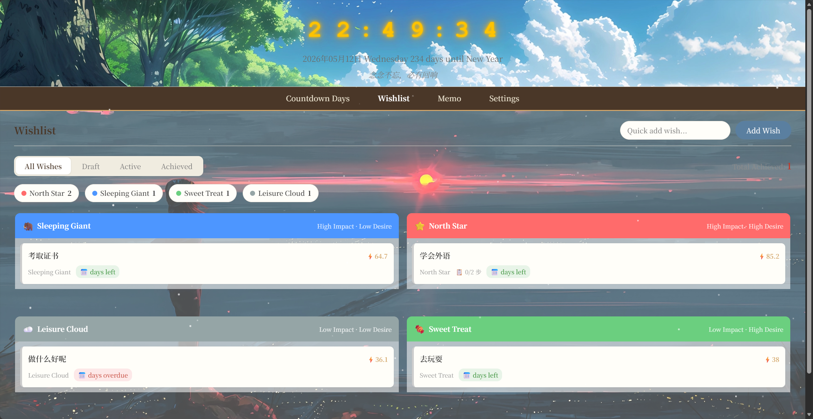

## ✨ 功能概览

### 📅 倒数日
- 多倒数本分类管理（首页 / 全部 / 归档 / 自定义）
- 重复事件（按天 / 周 / 月循环），**今天到期时显示提醒标识**
- 置顶、首页展示、高亮醒目、emoji 图标
- **附图管理**：上传图片、Lightbox 预览、左右切换浏览，按事项 ID 独立文件夹存储

### 🌟 愿望单
- **Wish Matrix 2×2 象限**：人生影响力 × 内心渴望值
- **优先级 ROI 公式**：`(Ripple × Fire) / Difficulty`
- 拖拽卡片跨象限移动、双滑块坐标选择
- 步骤拆解（1:N），进度自动计算
- 愿景板 ≤30 张，GLightbox 灯箱预览
- **心路历程**：Quill.js 富文本、QQ 签名式管理、荣誉墙滚动 + 渐变遮罩
- 状态筛选（全部 / 草稿 / 进行中 / 已达成）
- 庆祝达成 🎉 confetti 特效 + Canvas 流星许愿星空

### 📝 备忘录
- Gmail 式列表：星标 / 摘要 / 时间 / 附件图标
- **Vditor Markdown 编辑器**：实时预览、大纲目录、代码高亮、图片拖拽粘贴上传
- 读写分离：阅读模式 → 点击编辑 → 原地切换编辑器
- 附件管理：文件夹扫描、图片 Lightbox 预览、文件下载、延迟删除

### ⚙️ 系统功能
- **登录鉴权**：Flask-Login + werkzeug 密码哈希 + 记住我 (30天) + 暴力破解防护
- **SPA 导航**：无刷新页面切换，浏览器前进/后退支持
- **壁纸系统**：上传 / 随机切换 / 定时轮换 / localStorage 生命周期
- **内容区透明度**：滑块实时调节，CSS Variables 持久化
- **全量备份**：一键打包 `data/` 文件夹为 zip 镜像下载
- **调试日志**：RotatingFileHandler 10MB×10，开关控制
- **i18n 双语**：中文 / English

---

## 📦 快速开始 (Docker)

```bash
上传中，敬请期待
```

默认登录凭证: `admin` / `change_me_please`（**生产环境务必修改！**）

---

## 📁 数据持久化

所有用户数据存储在 Docker 卷映射的宿主机目录：

```
/opt/docker-stacks/daysmatter/
├── database/
│   └── main.db          # SQLite 数据库
├── uploads/
│   ├── countdown_days/  # 倒数日附图 (按 ID 分文件夹)
│   ├── wishlist/        # 愿望单愿景板
│   └── memos/           # 备忘录附件 + content.md
├── backgrounds/         # 壁纸图片
├── json/                # 配置文件 (settings.json / quotes.json / i18n)
└── log/                 # 调试日志 (app.log)
```

---

## 🔧 环境变量

| 变量 | 默认值 | 说明 |
|------|--------|------|
| `APP_USERNAME` | `admin` | 登录用户名 |
| `APP_PASSWORD` | `daysmatter2024` | 登录密码 |
| `SECRET_KEY` | 随机生成 | Flask Session 签名密钥（生产环境建议固定） |
| `TZ` | `Asia/Shanghai` | 容器时区 |

---

## 🛠️ 技术栈

| 层级 | 技术 |
|------|------|
| 后端 | Python 3.12 / Flask 3.0 / SQLite (WAL) / Flask-Login |
| 前端 | Vanilla JS (ES6+) / SPA 导航 / CSS Variables |
| 编辑器 | Vditor (Markdown) / Quill.js (富文本) |
| 媒体 | GLightbox (灯箱) / Flatpickr (日期) / canvas-confetti (特效) |
| 部署 | Docker / Docker Compose / Alpine Linux |


---

## 📄 开源协议

本项目基于 [MIT License](LICENSE) 开源发布。

---

<p align="center">
  <sub>每一颗流星，都是一个未完成的愿望 ✨</sub>
</p>

# English introduction

<p align="center">
  <h1 align="center">🌠 DaysMatter</h1>
  <p align="center"><em>Shooting Stars Wishlist — Your Personal Countdown, Wish Matrix & Memo System</em></p>
</p>

<p align="center">
  
  
  
  
  
  
</p>

---

## 🌈 Project Vision

DaysMatter is a self-hosted, ad-free personal productivity system that combines countdown tracking, intelligent wish management, and rich-text memos. Born from frustration with intrusive ads and limited customization in mobile apps, this open-source solution puts you in complete control of your goals and memories.

Memory: 25.37MB

## ✨ Live Preview

### Login Interface


### Countdown Module


### Wishlist Module


### Memos Module


### Settings Panel


### English Interface


---

## 🚀 Core Features

### 📅 Smart Countdowns
- **Multi-category Management**: Homepage / All / Archived / Custom collections
- **Recurring Events**: Daily, weekly, or monthly cycles with **today's reminder badges**
- **Visual Customization**: Pin to top, homepage display, highlight colors, emoji icons
- **Attachment Management**: Upload images, Lightbox preview, swipe navigation, ID-based folder storage

### 🌟 Wish Matrix System
- **2×2 Quadrant Analysis**: Life Ripple (impact) × Heart's Fire (desire intensity)
- **Priority Calculation**: ROI formula: `(Ripple × Fire) / Difficulty`
- **Interactive Controls**: Drag-and-drop between quadrants, dual-slider coordinate selection
- **Goal Breakdown**: Step-by-step decomposition (1:N) with automatic progress calculation
- **Vision Board**: Up to 30 images with GLightbox preview
- **Journey Logging**: Quill.js rich text editor, QQ-signature style management, honor wall with scroll gradient
- **Status Filtering**: All / Draft / In Progress / Achieved
- **Achievement Celebration**: 🎉 Confetti effects + Canvas shooting star animation

### 📝 Advanced Memos
- **Gmail-style Interface**: Starred items, summaries, timestamps, attachment icons
- **Vditor Markdown Editor**: Real-time preview, table of contents, syntax highlighting, drag-and-paste image upload
- **Read-Write Separation**: Reading mode → Click to edit → In-place editor switching
- **Attachment Management**: Folder scanning, image Lightbox preview, file download, delayed deletion

### ⚙️ System Features
- **Secure Authentication**: Flask-Login + werkzeug password hashing + Remember Me (30 days) + brute-force protection
- **SPA Navigation**: No-refresh page transitions with browser history support
- **Wallpaper System**: Upload / Random rotation / Scheduled cycling / localStorage lifecycle
- **Content Transparency**: Real-time slider adjustment with CSS Variables persistence
- **Full Backup**: One-click zip export of entire `data/` folder as mirror image
- **Debug Logging**: RotatingFileHandler (10MB×10) with toggle control
- **Bilingual Support**: English / 中文 (Simplified Chinese)

---

## 🐳 Quick Start (Docker)

```bash
# Coming soon - Upload in progress
```

**Default Credentials**: `admin` / `change_me_please` (**Must change in production!**)

---

## 💾 Data Persistence

All user data is stored in Docker volume-mapped host directories:

```
/opt/docker-stacks/daysmatter/
├── database/
│   └── main.db          # SQLite database (WAL mode enabled)
├── uploads/
│   ├── countdown_days/  # Countdown attachments (ID-based folders)
│   ├── wishlist/        # Wishlist vision board images
│   └── memos/           # Memo attachments + content.md
├── backgrounds/         # Wallpaper images
├── json/                # Configuration files (settings.json, quotes.json, i18n)
└── log/                 # Debug logs (app.log, error.log)
```

---

## ⚙️ Environment Variables

| Variable          | Default            | Description                                                  |
| ----------------- | ------------------ | ------------------------------------------------------------ |
| `APP_USERNAME`    | `admin`            | Login username                                               |
| `APP_PASSWORD`    | `daysmatter2024`   | Login password                                               |
| `SECRET_KEY`      | Randomly generated | Flask session signing key (recommend fixed value in production) |
| `TZ`              | `Asia/Shanghai`    | Container timezone                                           |
| `DEBUG_MODE`      | `false`            | Enable debug logging                                         |
| `MAX_UPLOAD_SIZE` | `10`               | Maximum upload size in MB                                    |

---

## 🛠️ Tech Stack

| Layer          | Technologies                                                 |
| -------------- | ------------------------------------------------------------ |
| **Backend**    | Python 3.12 / Flask 3.0 / SQLite (WAL mode) / Flask-Login / SQLAlchemy |
| **Frontend**   | Vanilla JavaScript (ES6+) / SPA Navigation / CSS Variables / Fetch API |
| **Editors**    | Vditor (Markdown) / Quill.js (Rich Text) / CodeMirror        |
| **Media & UI** | GLightbox (Lightbox) / Flatpickr (Date Picker) / canvas-confetti (Effects) / Chart.js |
| **Deployment** | Docker / Docker Compose / Alpine Linux / Nginx (Optional)    |
| **Storage**    | SQLite / File System / LocalStorage (Client-side)            |


---

## 📄 License

This project is open-source under the [MIT License](LICENSE).

---

## 🙏 Acknowledgments

Special thanks to:
- All open-source libraries that make this project possible
- Early testers and contributors
- The Flask and JavaScript communities
- Everyone who believes in ad-free, self-hosted software

---

<p align="center">
  <sub>Every shooting star carries an unwritten wish ✨</sub><br>
  <sub>Made with ❤️ for those who dream and do</sub>
</p>

---

*DaysMatter is actively maintained. *
